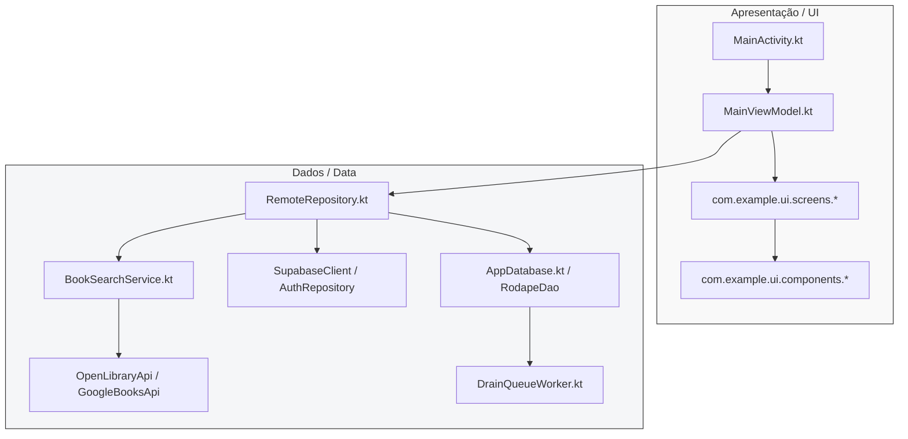

# Documento de Arquitetura de Software & Design System: Tramabook (Rodapé)

Este documento descreve a especificação de arquitetura, a organização estrutural do projeto Android, a análise do Design System e as críticas e considerações negativas da engenharia atual do aplicativo **Tramabook (Rodapé)**.

---

## 🏛️ 1. Arquitetura de Engenharia Atual vs. Recomendada

O Tramabook adota atualmente o padrão **MVVM (Model-View-ViewModel)** com um repositório centralizado de dados (`RemoteRepository`). Contudo, o app carece de separação estrita de camadas e viola princípios fundamentais do SOLID.



### 🔴 Crítica de Engenharia 01: O Anti-Padrão "God ViewModel"
O `MainViewModel.kt` possui **mais de 1.200 linhas de código** e gerencia o estado de praticamente todas as regras de negócio do app: autenticação, clubes, progresso do livro, chats/discussões, votações, notificações, pesquisas e configurações locais. 
* **Violação do Single Responsibility Principle (SRP):** Qualquer alteração em qualquer fluxo do aplicativo exige a modificação da mesma classe.
* **Complexidade de Testes:** Escrever testes unitários para o `MainViewModel` é extremamente trabalhoso devido ao acoplamento de múltiplos fluxos de dados distintos no escopo global.

### 🔴 Crítica de Engenharia 02: Acoplamento Direto com Supabase (Falta de Abstração)
O `RemoteRepository.kt` (de quase 100 KB) e o `AuthRepository.kt` conversam diretamente com as APIs concretas do SDK do Supabase. Não existem interfaces para desacoplar as implementações físicas.
* **Falta de Inversão de Dependência (DIP):** Se a equipe decidir mudar o backend para Firebase ou um serviço próprio REST no futuro, a camada de UI inteira sofrerá impactos massivos, pois os modelos de persistência, mutações offline e tratamento de dados estão amarrados à biblioteca concreta `io.github.jan.supabase`.

### 🔴 Crítica de Engenharia 03: Tratamento de Erros Frágil e Falhas Silenciosas
O repositório e o ViewModel capturam falhas de rede e RPCs de banco de dados em blocos `try-catch`, mas apenas imprimem a stack trace (`e.printStackTrace()`). O aplicativo falha silenciosamente, e o usuário final fica visualizando um *loading* infinito ou um estado congelado sem feedback.

### 🔴 Crítica de Engenharia 04: Isolamento de Banco Compartilhado (Risco de Segurança)
O Room database (`rodape-cache.db`) é compartilhado globalmente entre usuários do mesmo aparelho. Embora a limpeza seja feita via `dao.clearAll()` no momento do logout, se o app travar ou for forçado a fechar antes da execução do método, os dados residuais do cache local de um usuário podem vazar para outra conta que realizar login no mesmo aparelho.

---

## 📁 2. Organização e Estruturação de Pastas

### Estrutura Atual
```
com.example
│
├── MainActivity.kt
├── RodapeApp.kt
│
├── data/
│   ├── DataStoreManager.kt
│   ├── api/ (GoogleBooksApi, OpenLibraryApi)
│   ├── db/ (AppDatabase, PendingMutation, RodapeDao)
│   ├── model/ (User, Book, Club, Comment, etc.)
│   ├── remote/ (AuthRepository, RemoteRepository, Supabase)
│   ├── search/ (BookSearchService, UnifiedBookResult)
│   └── sync/ (DrainQueueWorker)
│
├── ui/
│   ├── admin/
│   ├── auth/
│   ├── components/
│   ├── screens/
│   ├── theme/ (Color, Theme, Tokens, Type)
│   └── viewmodel/ (MainViewModel)
│
├── util/ (CoverFiles, DateFormat, AppIntents)
└── voting/ (ChapterFetcher, VotingTally) <-- INCONSISTÊNCIA!
```

### 🔴 Crítica de Pastas 01: Pacote Top-Level `voting` sem Contexto
O pacote `com.example.voting` contém apenas dois arquivos utilitários de contagem de votos. Essa pasta foi "jogada" na raiz do projeto em vez de ser aninhada dentro de estruturas reutilizáveis como `data/search` ou `data/sync`.

### 🔴 Crítica de Pastas 02: Monolito de Telas em `screens`
Todas as 19 telas do app (desde a onboarding, perfil, discussões, até o log de moderação) estão jogadas soltas sob o pacote plano `com.example.ui.screens`. Isso gera poluição visual extrema no projeto e dificulta a modularização por features.

---

## 🎨 3. Especificação do Design System (Tokens de UI)

O Design System do Tramabook é inspirado no conceito de design físico e rústico de livros e leitura (estética aconchegante de papel, madeira e folhas de oliveira).

### Paleta de Cores (Definida em `Color.kt` e `Tokens.kt`)

| Token | Valor Hex | Tipo | Finalidade Visual |
|---|---|---|---|
| **Terracota** | `#B85838` | Primária / Acento | Botões de ação principais, acentos dinâmicos |
| **TerracotaDark** | `#8E3F25` | Primária Variação | Estados pressionados de botões primários |
| **TerracotaSoft** | `#FBE5DA` | Primária Suave | Fundo de alertas ou ícones destacados |
| **Oliva** | `#5C7349` | Secundária / Herói | Cor base de identidade visual, botões secundários |
| **OlivaDark** | `#3E5230` | Secundária Variação | Textos secundários destacados |
| **OlivaSoft** | `#E5EBDA` | Secundária Suave | Badges de status e fundos suaves |
| **Ink** | `#1B1F1A` | Texto Forte | Textos de alta ênfase (Títulos, Headings) |
| **InkSoft** | `#383C36` | Texto Corpo | Textos normais de leitura |
| **Muted** | `#8A8A80` | Texto Fraco | Placeholders, datas, textos secundários |
| **Paper** | `#F7F5EE` | Background Base | Fundo geral do app (remete à folha de livro físico) |
| **PaperDeep** | `#F0EEE5` | Background Alternativo | Divisores, barras ou áreas agrupadas |
| **CardSurface** | `#FFFFFF` | Superfície | Fundo de cartões de conteúdo destacados |
| **Divider** | `#E9E7DD` | Divisor Forte | Linhas de separação e bordas de cards |

### Tipografia e Escala Visual (Definida em `Type.kt`)
* **Display Large / Title Large:** Utiliza a fonte **Outfit** com peso SemiBold/Bold, focada em títulos marcantes e logos.
* **Body / Reading:** Utiliza a fonte **Inter** ou variações serifadas clássicas, garantindo legibilidade confortável e sem fadiga visual mesmo após longos períodos de leitura de comentários ou resumos.

---

## 🛠️ 4. Proposta de Refatoração & Reestruturação (Clean Architecture & Modularização)

Para que o projeto atinja o nível **100% de Prontidão para Produção**, é imperativo reorganizar a estrutura e criar fronteiras limpas de arquitetura.

### Reestruturação de Pastas por Feature (Sugerida)
```
com.example.rodape/
│
├── core/
│   ├── database/ (Room, Migrations)
│   ├── network/ (Supabase, Retrofit config)
│   ├── security/ (CredentialManager, Secrets)
│   └── theme/ (Design System, Tokens)
│
├── features/
│   ├── auth/ (Welcome, Login, SignUp, ResetPassword)
│   │   ├── data/ (AuthRepositoryImpl)
│   │   ├── domain/ (LoginUseCase, SignUpUseCase)
│   │   └── presentation/ (AuthViewModel, AuthScreens)
│   │
│   ├── club/ (CreateClub, JoinClub, ManageClub, Members)
│   │   ├── data/ (ClubRepositoryImpl)
│   │   ├── domain/ (CreateClubUseCase)
│   │   └── presentation/ (ClubViewModel, ClubScreens)
│   │
│   ├── book/ (BookDetail, Shelf, BookSuggestions)
│   │   ├── data/ (BookRepositoryImpl)
│   │   └── presentation/ (BookViewModel, BookScreens)
│   │
│   └── chat/ (Discussions, Comments, Reactions)
│       ├── data/ (ChatRepositoryImpl)
│       └── presentation/ (ChatViewModel, ChatScreens)
│
└── RodapeApplication.kt
```

### Plano de Ação Imediato para a Engenharia
1. **Desmembrar o `MainViewModel`:** Separar a classe monolítica em ViewModels específicos por feature (`AuthViewModel`, `ClubViewModel`, `BookViewModel`, `ChatViewModel`, `NotificationViewModel`).
2. **Definir Interfaces de Repositório (DIP):** Criar `AuthRepository` e `RodapeRepository` como interfaces no pacote de domínio e colocar as classes Supabase (`SupabaseAuthRepositoryImpl`, `SupabaseRemoteRepositoryImpl`) no pacote de dados.
3. **Mapeamento de Erros para UI:** Criar um objeto de erro unificado (ex: `sealed interface UIState<out T>`) para que toda chamada de rede atualize a UI com estados amigáveis de falha (`UIState.Error(msg)`) em vez de falhar silenciosamente no `try-catch`.
4. **Isolar Banco de Dados por Usuário:** Modificar a instância do Room no `AppDatabase.kt` para usar o ID do usuário autenticado no nome do arquivo físico:
   ```kotlin
   val dbName = "rodape-cache-${userId}.db"
   ```
   Isso garante isolamento criptográfico e físico total entre múltiplas contas no mesmo dispositivo.
